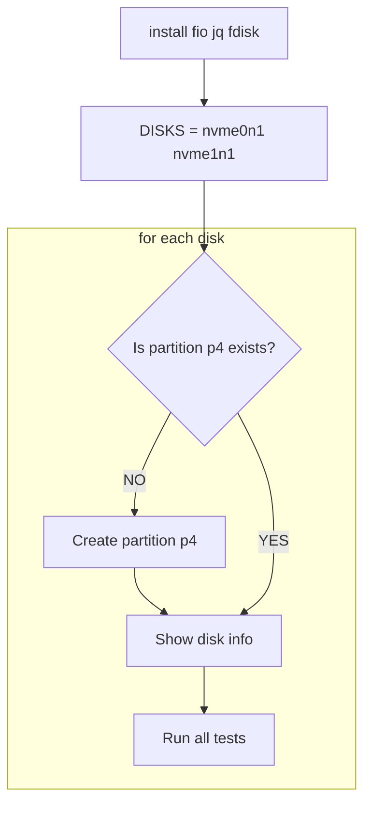

# pve-scripts

Collection of scripts for PVE

## switch.sh

Here is the script for switching a virtual machine with a pass-through video card
Requires VirtIO Guest to send a hibernate command!
Requires Swap on Linux for hibernate
How it works:

- The script sends the hibernate command
- Then waits for VM to shut down
- Then starts up another VM

## fio.sh

### V1
Это простой скрипт для тестирования конкретных дисков nvme0n1 nvme1n1.

Скрипт предполагает наличие тестового раздела P4 в конце диска, или свободного места для его создания.

Скрипт не предназначен для тестирования произвольных дисков или разделов.

### V2
Это простой скрипт для тестирования дисков.

При запуске можно передать диск(и) для тестирования (./fio nvme2n1).

При запуске без параметров, скрипт сам выберет диски nvme0n1 nvme1n1.

Скрипт предполагает наличие тестового раздела p128 в конце диска, или свободного места для его создания.

Во время теста данные на разделе будут изменены (испорчены)

В конце теста раздел 128 будет удален, так как данные на этом разделе в любом случае бесполезны.

